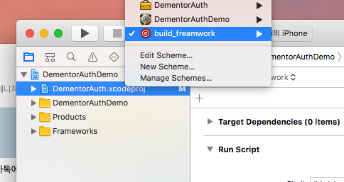
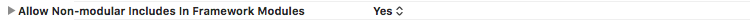
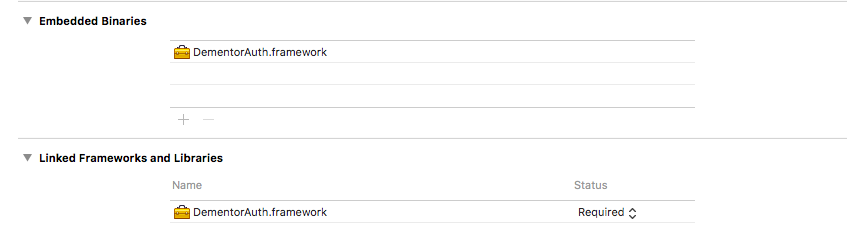
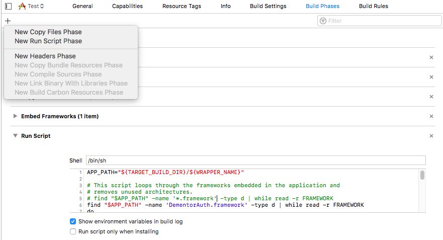

#DEMENTOR IOS SDK 빌드 하기
### 1. 빌드하기
> 프레임워크 프로젝트를 선택한 후 build_framwork를 선택한후 실행하면 Desktop(바탕화면)에 DementorAuth.framework가 생성됩니다.




#DEMENTOR IOS SDK 적용가이드
## 변경 사항
- 기존에 static 모듈로 작업 되어 있던 부분을 framework로 변경 하여 진행 하였습니다.
- 기존보다 매체사에서 적용하기 편리하도록 구조를 변경 하였습니다.
- 모든 써드파티 라이브러리의 버전을 업데이트 하였습니다.
- 거의 모든 부분에 대해서 새로 작성하였습니다.


## DEMENTOR SDK 구성
- framework/DementorAuth.framework (32bit / 64bit merge된 framework)

	> lipo -info framework/DementorAuth.framework
Architectures in the fat file: DementorAuth.framework/DementorAuth are: <font color="red">x86_64 i386 armv7 armv7s arm64</font>


> merge framework를 이용하실 경우에는 [Merge Framework적용](#3-merge-framework적용)을 확인해 주세요.


## SDK 적용하기

###  1. XCODE 설정


####  1.1 Project-Build Setting 설정
> 'Project - Build Settings'에서 'Allow Non-modular Includes in Framework Modules' 값을 YES로 설정합니다.



##### 1.4 DementorAuth.framework 추가
> 'Project-General'에서 'Embedded Binaries'에 DementorAuth.framework를 추가한다. 정상적으로 추가 되었을 경우, 아래와 같이 추가 됩니다.




### 2. DementorAuth 사용하기

#### 2.1 헤더 import
```objectivec
#import <DementorAuth/DementorSDK.h>
```

#### 2.2 DementorAuth 기본 설정
기본 서버 설정 및 사용자 셋팅을 한다.
서버 설정의 경우 AppDelegate.m에서 최초 1번 설정하는것이 좋습니다.
```objectivec
- (BOOL)application:(UIApplication *)application didFinishLaunchingWithOptions:(NSDictionary *)launchOptions {
    // Override point for customization after application launch.
    [DementorSDK sharedInstance].port = @"8080";
    [DementorSDK sharedInstance].host = @"http://127.0.0.1";
    return YES;
}
```

#### 2.3 DementorAuth 사용자 설정
사용자에 대한 정보를 가져올수 있을 경우에 사용자 정보를 설정 합니다.
해당 정보가 입력 되지 않은 상태로 Dementor를 실행할경우 원하는 동작을 하지 않을수 있습니다.
```objectivec
{
    [DementorSDK sharedInstance].ctn        = @"01000000000";
    [DementorSDK sharedInstance].deviceId   = @"123456789";
}
```

#### 2.4 콜백을 받기 위한 리스너 등록 및 광고 호출


ViewController에 DementorDelegate 등록합니다.
```objectivec
@interface ViewController : UIViewController<DementorDelegate>
```
Delegate 등록
```objectivec
[DementorSDK sharedInstance].delegate = self;
```

Callback 메소드 구현
```objectivec
/*
 code : 정상적으로 모든 액션을 다 했을 경우 서버로 부터 전달 받은 code값
 errorCode : 실패시에 에러 코드
 controlDelegate : 현재 떠 있는 Controller에게 명령을 내릴수 있는 델리게이트 (재시도, 닫기) controllerRetry, controllerDismiss
 libVer : 라이브러리 버전
 message : 실패시에 에러 메세지
 */
//Callback 함수 작성
- (void)verificationCode:(NSString *)code errorCode:(NSString *)err controlDelegate:(id<DementorControllerDelegate>)retry libVer:(const NSString *)ver message:(NSString *)msg {

}

/*
 사용자가 그냥 상단에 Back으로 돌아왔을경우
*/
- (void)onBack {

}

```

+ (void) startRegsterView:(UIViewController *) controller;

+ (void) startAuthView:(UIViewController *) controller;

+ (void) startReRegsterView:(UIViewController *) controller;


####2.5 회원 등록 화면 노출
회원 등록 화면을 노출한다.
인자값으로 최상단의 컨트롤러를 넣어야 한다.
```objectivec
 [DementorSDK startRegsterView:self];
```

####2.6 로그인 화면 노출
로그인 화면을 노출 한다.
```objectivec
 [DementorSDK startAuthView:self];
```

####2.7 비밀번호 재등록 화면 노출
```objectivec
 [DementorSDK startReRegsterView:self];
```


####3. Merge Framework적용
> DementorSDK는 하나의 프레임워크에 32bit와 64bit가 함께 포함되어 있습니다. 이는 시뮬레이터(32bit)와 단말기(64bit)로 개발시 용이하게 하기 위함입니다.
 32bit/64bit 합쳐진 framework의 경우 App Store에 배포 할때 에러가 발생하게 됩니다. 따라서 아래 스크립트를 이용해서 빌드시에 필요한 framework만 빌드하도록 합니다.

- Target -> Build Phases -> Run Script를 추가합니다.

- Run Script 부분에 아래 스크립트를 추가합니다.

```javascript
APP_PATH="${TARGET_BUILD_DIR}/${WRAPPER_NAME}"

# This script loops through the frameworks embedded in the application and
# removes unused architectures.
# find "$APP_PATH" -name '*.framework' -type d | while read -r FRAMEWORK
find "$APP_PATH" -name 'DementorAuth.framework' -type d | while read -r FRAMEWORK
do
FRAMEWORK_EXECUTABLE_NAME=$(defaults read "$FRAMEWORK/Info.plist" CFBundleExecutable)
FRAMEWORK_EXECUTABLE_PATH="$FRAMEWORK/$FRAMEWORK_EXECUTABLE_NAME"
echo "Executable is $FRAMEWORK_EXECUTABLE_PATH"

EXTRACTED_ARCHS=()

for ARCH in $ARCHS
do
echo "Extracting $ARCH from $FRAMEWORK_EXECUTABLE_NAME"
lipo -extract "$ARCH" "$FRAMEWORK_EXECUTABLE_PATH" -o "$FRAMEWORK_EXECUTABLE_PATH-$ARCH"
EXTRACTED_ARCHS+=("$FRAMEWORK_EXECUTABLE_PATH-$ARCH")
done

echo "Merging extracted architectures: ${ARCHS}"
lipo -o "$FRAMEWORK_EXECUTABLE_PATH-merged" -create "${EXTRACTED_ARCHS[@]}"
rm "${EXTRACTED_ARCHS[@]}"

echo "Replacing original executable with thinned version"
rm "$FRAMEWORK_EXECUTABLE_PATH"
mv "$FRAMEWORK_EXECUTABLE_PATH-merged" "$FRAMEWORK_EXECUTABLE_PATH"

done
```
